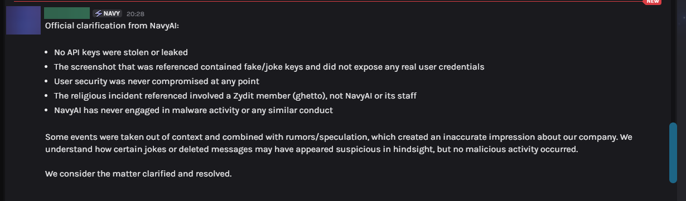
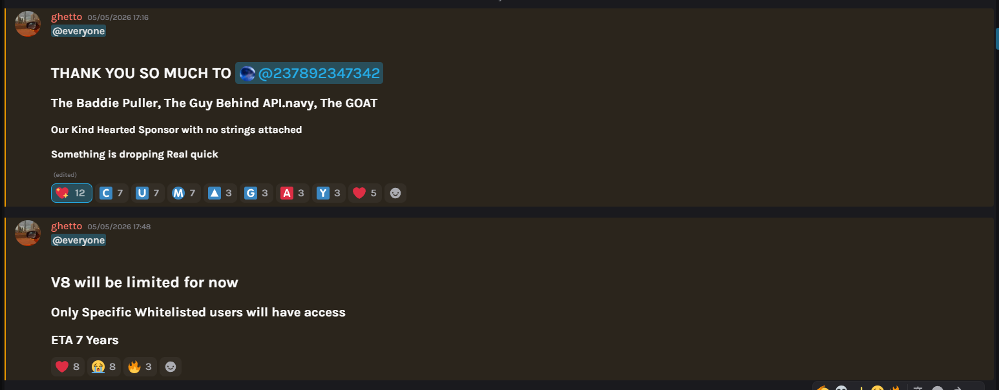
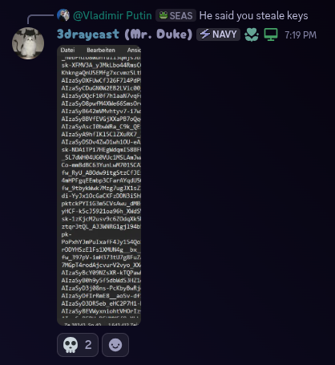
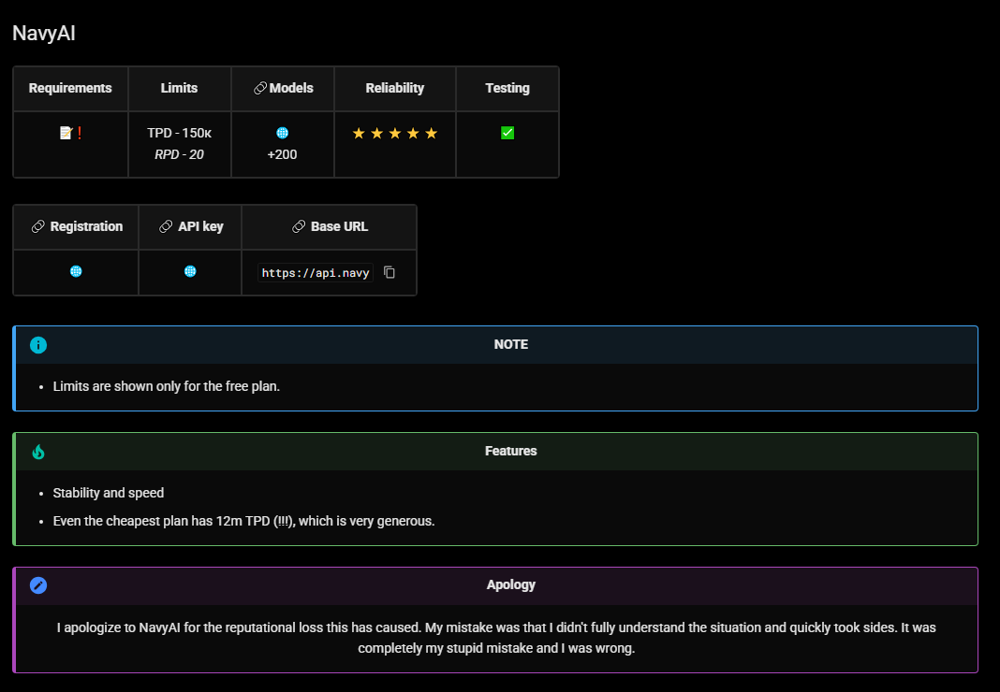
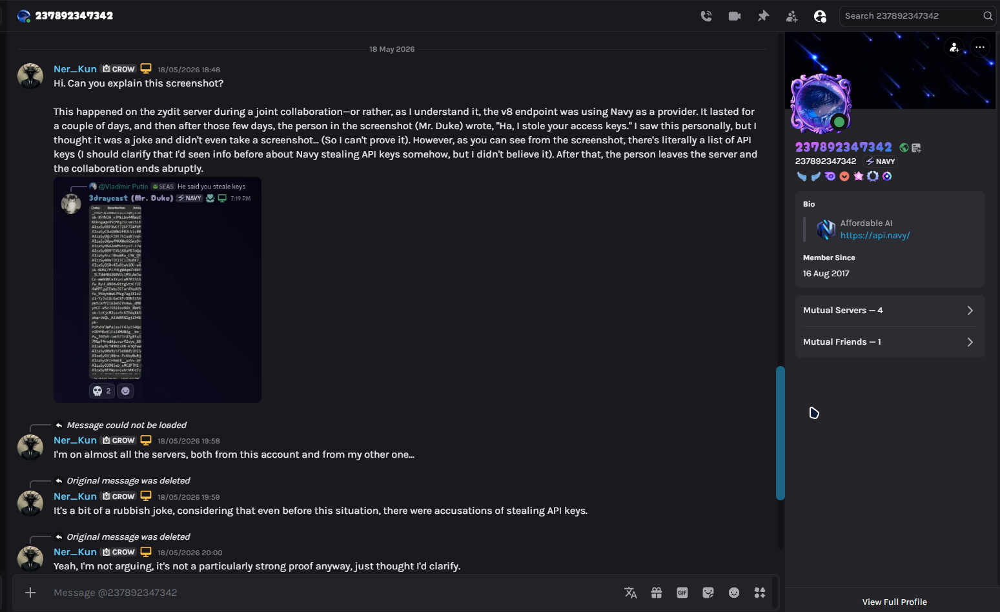

# Warning

!!! warning "DISCLAIMER"
    Providers listed here have **unconfirmed or circumstantial** concerns.
    This is not a definitive judgment - use your own discretion.

---

### NavyAI

#### UPD: Official Response from NavyAI

<figure class="screenshot-gallery">
  

    
    <figcaption>Official clarification from NavyAI team</figcaption>
  

</figure>

**My position after this response:** I consider the conflict resolved. If no new information emerges, this warning will be completely removed.

---

#### Background

Even before any events took place, I periodically came across mentions of the NavyAI service in a negative light. Most discussions revolved around potential security issues - specifically, rumors about the theft or unauthorized use of other people's API keys. At the time, I didn't pay much attention to it, but the information stuck with me.

#### Zydit × NavyAI Collaboration

Some time ago, Zydit announced a collaboration with NavyAI. I don't know the exact terms of the partnership, but the gist was that NavyAI provided  with access to their service. For the first couple of days, everything worked stably (see Screenshot 1 - you can see them thanking the sponsor). I actively used this opportunity and burned through about 70 million tokens during that time. No issues at the time - quality was excellent, and NavyAI deserves credit for that.

<figure class="screenshot-gallery">
  

    
    <figcaption>Screenshot 1: Collaboration announcement - sponsor thanks visible</figcaption>
  

</figure>

#### The Key Incident

After a while, the collaboration was abruptly terminated. In the Zydit Discord server, a user named **"Mr. Duke" (3draycast)** published a message saying *"I stole your access keys"* (unfortunately, I don't have a screenshot of that specific message). When asked about it, he displayed a list that visually resembled **API keys** (Screenshot 2).

**About Mr. Duke:**
- At the time, he was listed as a **sponsor of the event** in collaboration announcements
- Whether he's a NavyAI employee, owner, or just a third party - I don't know
- He frequently changed his nickname, usually to random number sequences
- Current nickname: **"237892347342"** (other screenshots show different names, but it's the same account)

Shortly after, these messages were **deleted**.

<figure class="screenshot-gallery">
  

    
    <figcaption>Screenshot 2: Mr. Duke's message with allegedly stolen API keys</figcaption>
  

</figure>

#### My Attempt to Clarify

Since I had a prior conflict with NavyAI (I made a hasty decision back then and later publicly apologized - Screenshot 3), I decided to message the person who represented the NavyAI team in that conversation. I don't know his exact role, but based on previous interactions, he's either a manager, someone close to management, or possibly Mr. Duke himself.

His responses shifted:
- First, he claimed the keys were created *"for a test"*
- Then he said it was *"a joke"*, the keys were invalid, and generated via ChatGPT

I wasn't planning on taking screenshots. Why? Honestly, I didn't want to get involved in a conflict again, but what happened next prompted me to write what you're reading now. (So yeah, if it weren't for that move of his, none of this would have happened.)

The next day, **all messages from Mr. Duke were deleted** - both those before my question and those after. Only my replies remain, now without the original context (Screenshot 4).

<figure class="screenshot-gallery">
  

    
    <figcaption>Screenshot 3: My public apology from a prior conflict with NavyAI</figcaption>
  

  

    
    <figcaption>Screenshot 4: Deleted messages - only my replies remain without context</figcaption>
  

</figure>

#### Additional Circumstances

- **Off-topic questions.** During the conversation, the NavyAI representative asked me: *"Why are you even on servers like that?"* In the context of discussing a key leak, this seemed strange - like an attempt to deflect from the core issue.
- **Other complaints.** ~~Concurrently, information surfaced about another incident: someone from the NavyAI team (possibly the same Mr. Duke) made a religiously offensive remark (this might have been the reason for the collaboration's termination, but I didn't press for details, and neither side is likely to tell the truth). There was also a user who accused NavyAI of racism and provided evidence, but asked not to share it publicly. The existence of such complaints doesn't prove guilt - these are private interactions - but it's food for thought.~~

    > **UPD:** Both points clarified. The religious remark was made by a Zydit member (ghetto), not NavyAI staff - that person has since apologized and left Zydit. The racism allegation was a personal conflict with a specific individual (not the team as a whole) and has been resolved amicably.
- **Malware attempt.** Around the same period, an attempt to upload an executable file was detected on the  server. The protection system (CrowdStrike) automatically detected and neutralized the threat, so no digital traces remain. **I'm not claiming this was an attack by NavyAI** - there's no direct evidence. But the chronological coincidence with the abrupt end of the collaboration is suspicious.

#### Conclusion and My Position

I'm an ordinary user, not a representative of any side. I have no irrefutable proof of NavyAI's guilt, and I'm not making final judgments for others.

However, the facts form a chain that's hard to ignore:

1. During an official collaboration, a person presented as a sponsor publishes what looks like someone else's API keys and claims to have "stolen" them.
2. After a public question, a team representative gives contradictory explanations (test, joke, AI-generated), then deletes the entire conversation.
3. ~~Parallel complaints surface about NavyAI team behavior (religious/racial insults) - this doesn't prove NavyAI's guilt, as these are private interactions, but the fact itself is notable.~~
4. During the same period, a malware upload attempt is detected on a partner's server - no traces, but suspicious timing.
5. The collaboration ends abruptly without a public technical report.

All of this *could* be a series of unfortunate coincidences, inappropriate jokes, or internal disputes that shouldn't concern me. But the deletion of messages, the lack of a transparent review, and recurring "oddities" make it reasonable to approach the situation with heightened caution.

I leave this as an open observation. Everyone has a head on their shoulders: it's not just for eating, but for thinking too. Let everyone draw their own conclusions based on the available facts.

---

### FreeModel

#### Source of Information

One of the FreeModel users reached out to me with the following story.

#### The Incident

A user topped up his account with **$100**. He was having trouble accessing **Claude**, so he contacted support. Instead of trying to resolve the issue or even explain what was wrong, **they simply banned him** - meaning he effectively **lost his money**.

!!! warning "Important"
    **Do not pay FreeModel.** Use only the free plan. Paying them is **entirely at your own risk** - there is no guarantee you will get what you pay for, nor that your account will remain active.

---

### Composite & CrowLLM

#### Public Accusations

I was sent Discord screenshots where representatives of **Composite** wrote:

> *"They're using stolen API keys. Don't use them if you value security."*

**Meanwhile, Composite itself doesn't hide that it analyzes your prompts** (more on that below).

No warning. No private inquiry to the other side - straight to a public accusation.

I read the correspondence between the owners. Yes, **CrowLLM** was more aggressive. But we can cut him some slack here - it was probably an impulsive act. Or maybe that’s just his personality.  Sure, it’s not nice, but what would you have done? 
To **Composite** I'll say directly: it's not right to talk behind people's backs. But I'm not heavily judging either side. People get emotional under pressure and competition. I understand, but I don't condone it.

#### The Security Question

Composite makes security a talking point, yet can't back it up.

#### Fact 1: NVIDIA Forum Complaint

There's a thread on the NVIDIA developer forum:
🔗 [Third-party proxy composite.seabase.xyz - violation of terms?](https://forums.developer.nvidia.com/t/third-party-proxy-composite-seabase-xyz-is-rate-limiting-and-monetizing-free-nvidia-nim-api-access-in-violation-of-nvidias-terms/371301)

**The gist:**
- Composite proxies free **NVIDIA NIM endpoints**.
- It imposes its own rate limits and shows ads - monetization, effectively.
- Traffic goes through *their* accounts, not the user's - the source is masked.

No official response from NVIDIA yet. But **the fact of the complaint alone is already worth considering**.

#### Fact 2: ToS and the Security Paradox

I reviewed their [TOSl](https://composite.seabase.xyz/extras/tos.html). Notable clause:

> *"Except: Spamming... Roleplaying pedophilic content..."*

I fully agree with that. **However!**

They don't explicitly claim confidentiality. But how can security exist without confidentiality?

> To prohibit certain content, you need to **detect** it.
> That means they **scan** everything passing through their servers.

If you accidentally send something confidential - what chance is there it won't be stored, analyzed, or used?

**And equally important: prompt injection.** Everything goes through their server. You send 100, 1000 requests - all fine. On the 1001st request, a prompt injection could arrive that does something bad.

Do they do this? I don't know.
Could they? **Absolutely.**

Murphy's Law: *"If shit can happen, it will - and at the worst possible moment."*

And this applies to any provider: paid, free, or "official." The user probably won't even realize it happened.

#### Fact 3: "We're Better Than OpenRouter"

Their new site literally says they're better than OpenRouter because:
- supposedly confidentiality,
- and cheaper because *"we optimize your input and output data."*

**Wait.**

So they process your prompts - and still claim confidentiality? 🤔

- How exactly is this done?
- Is it documented anywhere?
- Or are they using the same approach as **Caveman** or **RTK**? (Just as examples.)

If so - that's actually clever, because you can already do that yourself.

> I'll repeat: I don't know how it works internally.
> But how can "prompt optimization" and "confidentiality" coexist? I genuinely don't know.

**And here's what else matters:**
- Open source? **No.**
- Independent audit? **No.**
- Provider list? **No.**

About providers they say: `legitimately sourced responses`.
Nobody disputes they *could* be official. But how do you know **what sits between your prompt and the official models?**

**You can't.**

#### Aggregators and Black Boxes

**CrowLLM** updated their ToS but still hasn't disclosed which providers they work with.

And you know what? **I get it.**

What niche aggregator in their right mind would write *"here are my providers"*? If the providers are good, competitors will swoop in. It's business.

But then **Composite** is no different: they never mention they're using **NVIDIA NIM**. In private correspondence, the owner sent "proof" of official access - but the log file had no attachments, so I couldn't verify.

And nowadays, anything can be convincingly faked with AI.

> Maybe they have an agreement with NVIDIA? **Unlikely.**
> More plausible: they're abusing free access through their servers.

That's their right to take that risk. But you, users, should understand what it means.

#### CrowLLM and Grok Access

On a direct question about abuse, I got this answer:

> *"We don't do it directly. Access is obtained through another official company that provides us with Grok access. I don't know exactly how it's set up."*

The owner can't tell me directly. **But I can draw conclusions.**

**Key point:** even large, "trusted" providers most likely aren't above similar schemes. They just **will never admit it**.

- Using resellers? Possibly.
- Buying access through third parties? Likely.
- Stolen API keys? Possible.
- Abusing free limits through account pools? Who's going to check - and how would you even verify?

**No one admits it. Because admission = reputational damage.**
**But proving the opposite is nearly impossible too.**

So the question isn't *"who does this and how."*
The question is: **are you willing to trust someone who can't - or won't - explain how their operation works?**

---

#### The Bottom Line

**I'll keep it short for those tired of reading:**

**In this industry, there is no real confidentiality or security - except running models locally.**

- **A free aggregator/proxy or whatever?** You're product.
- **Paid service?** They can promise anything, but the backend is closed - you can't verify.
- **Direct key from OpenAI/Anthropic?** They train on your data (unless you explicitly opt out, and even then, no guarantees).
- **Accidentally leaked something sensitive?** It's probably already being processed.

**The only way to be certain - run models locally.**
Everything else is a compromise. The only question is what compromise you're willing to accept.

#### Why I Didn't Contact Composite

You might ask: *"Did you reach out to Composite for their side?"*

**No. I didn't.**

Why? Did they contact the CrowLLM owner first? Doesn't look like it. So why should I? I did the same thing they did.

**If both sides prefer a public showdown and throwing shit at each other, that's their choice.** My job is to document what I see and let you decide.

#### A Final Word to Aggregators and Everyone in This Snake Pit

**Look at yourselves first.**
**If you demand transparency from others - start with yourselves.**
If you accuse others of breaking rules - make sure you're following them yourselves.

There are no holy people, just like there are no services; there are only those who can hide their dark nature well.

That's it.

---
!!! quote "P.S."
    I also want to say that if this table becomes unavailable, stops updating (and I have big plans for it), or something like that happens... Maybe some of this was true, and that truth was inconvenient for someone.
